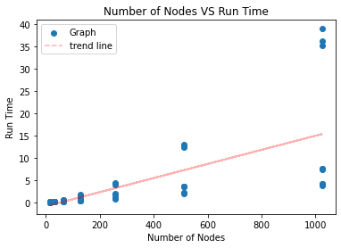
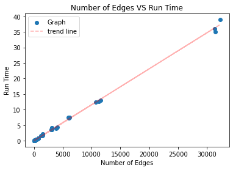

#### CSE 417: Homework 3
##### Name: Qingchuan Hou
##### Student ID: 2127437
##### UWNetID: qhou
 

##### Probelm 4 Report:

The main function I used in Problem 4 code is DFS algorithms. I added two main additional steps in the articulation points finding algorithm to find the biconnected components:
1. Store the edges in a temporary list in order of exploered
2. When the algorithms compare the edge $(v,x)$ and find v is an articulation point, take out all edges store in the temporary list after $(v,x)$ *(include edge $[v,x]$)*. All these edges are a biconnected componenet. Then store these edges in an biconnected component list. 

Because the process of storing and taking out is performed sequentially, there is no need to search the entire temporary list each time. All these operations are performed on edges, so if there are n edges in the graph, then this process only needs 2n operation time. Of course, after taking out the edges from the temporary list, some steps are still required to allocate the removed edges to the list of biconnected components that are stored separately. But the run time of the whole process is still $O(n)$.

Here are two graphs show the number of nodes versus run time and the number of edges versus run time.

      

As can be seen from the comparison of the two plots, the main factor affecting the run time is the edges number. Because biconnected components are not composed of nodes, but composed of edges. And this is same with my analysis of the algorithm. The algorithm mainly operates on edges. Although in the left plot, the increase of nodes will also increase the run time, the essential reason is that as the number of nodes increases, the number of edges increases. Of course, the graphs used in all plots are fully connected graphs. If there are many scattered un-connected components in the graph, because here the run time of DFS is $O(n+m)$, which n and m are the edges and nodes. Then number of nodes will affect the run time.

Look at the trend line in the polt for the number of edges versus run time. The trend line in the plot is still very close to the position of each point. The trend line can represent a behave of the $O()$ bounds, which is $O(n)$ like what I mentioned before.

##### Processor/Memory system:
Apple M1 Pro chip (8 cores) with 16 GB LPDDR5 Memory