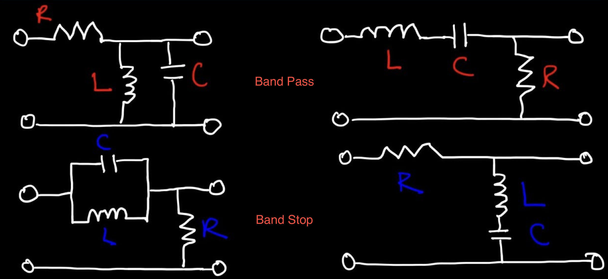

- [RLC Circuit](#rlc-circuit)
  - [Frequency Filter](#frequency-filter)
    - [Low-Pass and High-Pass Filter](#low-pass-and-high-pass-filter)
    - [Band Pass and Band Stop Filter](#band-pass-and-band-stop-filter)
- [Bipolar Junction Transistors (BJT)](#bipolar-junction-transistors-bjt)
  - [Amplifier](#amplifier)
- [MOS](#mos)

**Analog Circuit**

## RLC Circuit
### Frequency Filter

#### Low-Pass and High-Pass Filter
Reluctance Frequency: $f_r = \frac{1}{2\pi \sqrt{RC}} = \sqrt{f_Hf_L}$

Inductor(L): Pass Low level frequency
Conductor(C): Pass High level frequency

#### Band Pass and Band Stop Filter

## Bipolar Junction Transistors (BJT)

base, collector, emitter

The arrow is current direction for emitter

Cutoff: $V_{BE} < 0.6, \ V_{CE} = V_{CC}, \ I_C = 0 $
Active: $V_{BE} \ge 0.6, \ 0 < V_{CE} < V_{CC}, \ I_C > 0 $
Saturation: $V_{BE} \> 0.6, \ V_{CE} = 0 $

### Amplifier

## MOS

current mirror

amplifying transconductance

