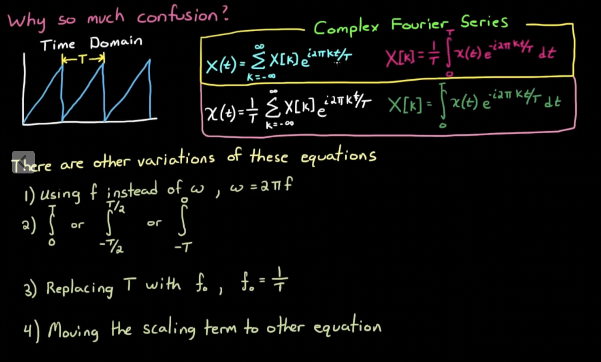
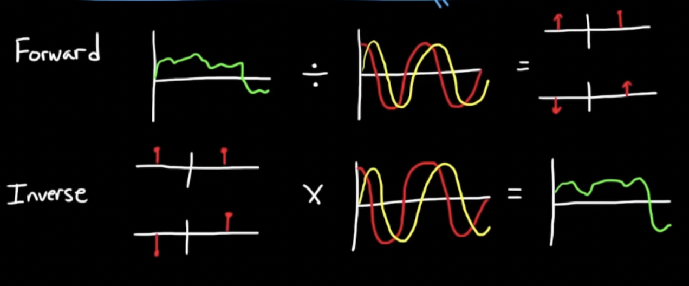
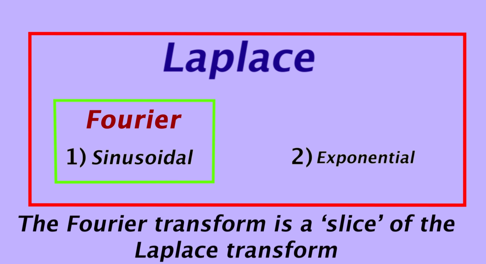
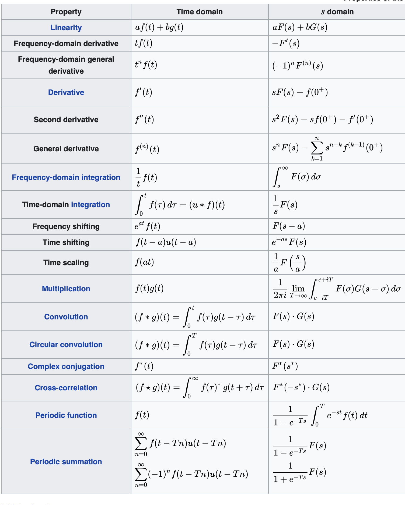
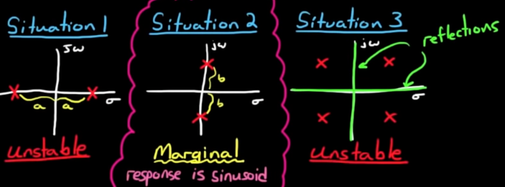
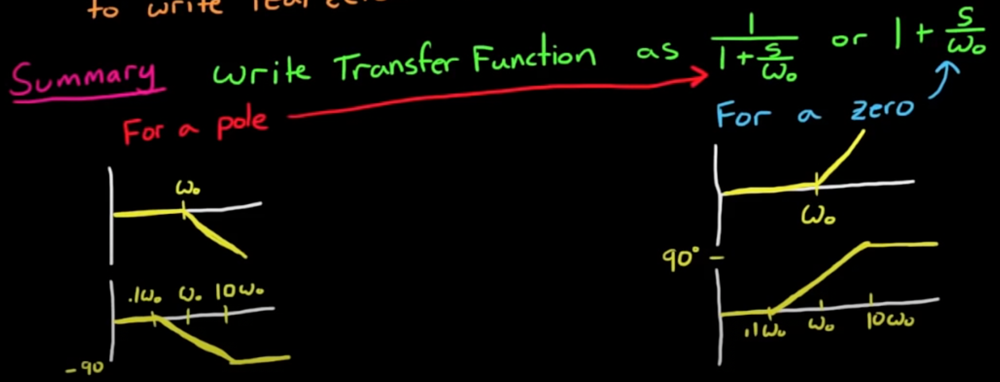
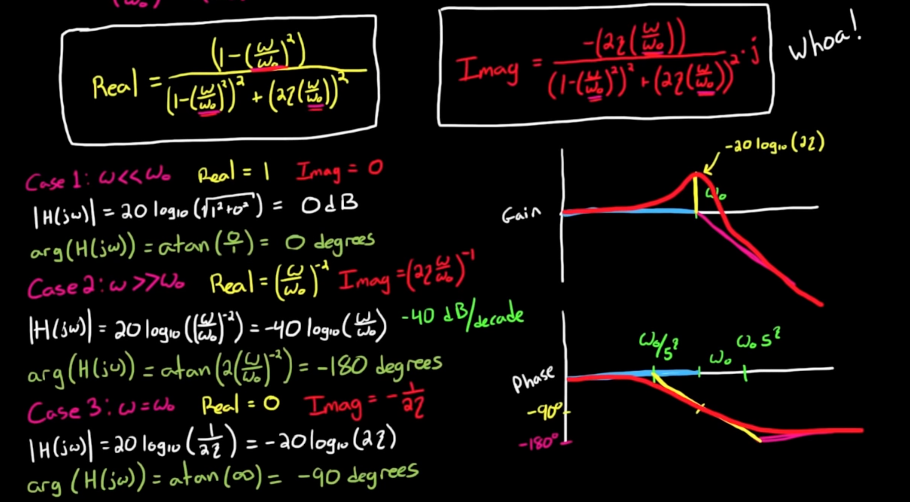

- [Control System](#control-system)
  - [Time and Frequency Domain](#time-and-frequency-domain)
    - [Fourier Transform:](#fourier-transform)
    - [Laplace Transform](#laplace-transform)
    - [Linear and Time Invariance (LTI) System](#linear-and-time-invariance-lti-system)
  - [Transfer Function](#transfer-function)
  - [System's Stability](#systems-stability)
    - [Routh-Hurwitz Criterion](#routh-hurwitz-criterion)
  - [Bode Plot](#bode-plot)
    - [Pole and Zeros](#pole-and-zeros)
      - [Single Pole / Zero](#single-pole--zero)
      - [Two Poles](#two-poles)
    - [Taylor Series](#taylor-series)
# Control System

## Time and Frequency Domain

[Youtube Video](https://www.youtube.com/watch?v=noycLIZbK_k&list=PLUMWjy5jgHK1NC52DXXrriwihVrYZKqjk&index=3)

All frequency is multiple of the 1st harmonic.

### Fourier Transform:
$$ \text{Time \qquad \qquad <==> \qquad \qquad Frequency} \\
f(t) \qquad  \text{Fourier Transform} \qquad \quad F(\nu) \quad \\
\nu = 2\pi / \omega \; (\text{Hz})$$

$$f(x) = \int^\infin _{-\infin} g(t) e^{-2\pi ift} dt $$

$$X(\omega) = \int^\infin _{-\infin} x(t) e^{-i\omega t} dt $$

$$F(\nu ) = \int^\infin _{-\infin} f(t) e^{-2\pi ift} dt $$

**Inverse Fourier Transform:**
$$f(t) = \int^\infin _{-\infin} F(\nu ) e^{2\pi ift} dt $$

### Laplace Transform
[YouTube Video](https://www.youtube.com/watch?v=n2y7n6jw5d0&t=28s)

$$X(s) = \int^\infin _{-\infin} x(t) e^{-st} dt \qquad (s = \alpha + i\omega)$$

Exponential term $e^{- \alpha t}$ ; damping
Sinusoid term $e^{j \omega t}$: spring constant

### Linear and Time Invariance (LTI) System

1. Sinusoidal 
2. Exponential (Overdamped)
3. Sinusoidal + Exponential (Underdamped)

## Transfer Function

$$H(s) = \frac{zeros}{poles}$$ 

## System's Stability

$ H(s) = N(s)/D(s) $

D(s): Characteristic Equation
All roots of D(s) must negative real to let system stable, must in LHP (left half plant)

If D(s) have different sign, the system is unstable; Ex: $G(s) = \frac{1}{s^4-s^3+s^2+1}$

### Routh-Hurwitz Criterion

Sign change 2 time, so have 2 poles in RHP, it's unstable.

**Special Case** ([YouTube Video](https://www.youtube.com/watch?v=oMmUPvn6lP8&list=PLUMWjy5jgHK1NC52DXXrriwihVrYZKqjk&index=19))
- Special Case 1: A zero in a row with at least one non-zero appearing later in that same row.
- Special Case 2: The entire row is zeros, there are three situations.

## Bode Plot

### Pole and Zeros
Because $ s  = \frac{1}{1/s}$

Gain Equation 

#### Single Pole / Zero 
Transfer function with signal real pole: $\frac{1}{1+\frac{s}{\omega _0}}$

gain = $ 20 log_{10} |H(j\omega)| = -20 log_{10} (\sqrt{1+\frac{\omega ^2}{\omega _0^2}}) $

phase = $atan(imag/real) = atan(-\frac{\omega}{\omega_0})$

#### Two Poles

$$ H(s) = \frac{\omega_0^2}{s^2 + \zeta \omega_0 s + \omega_0^2}$$

### Taylor Series
[YouTube Video](https://youtu.be/3d6DsjIBzJ4)