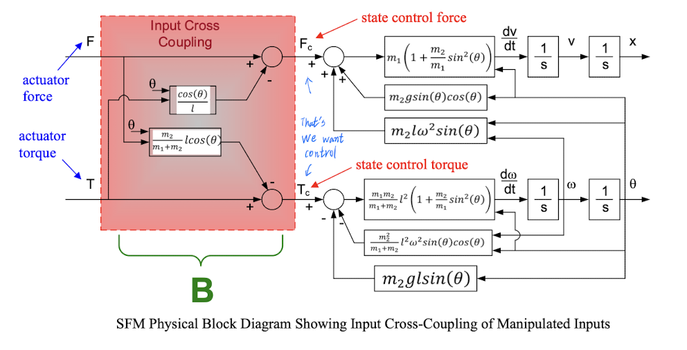
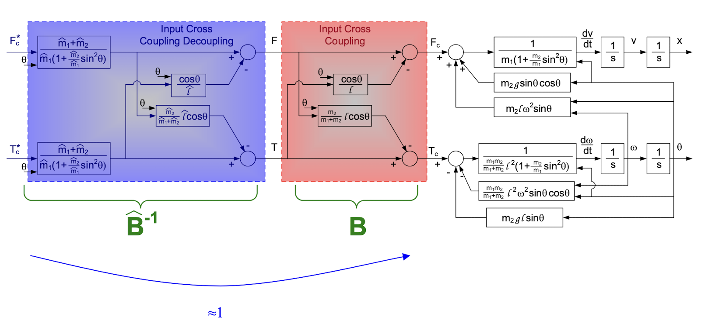
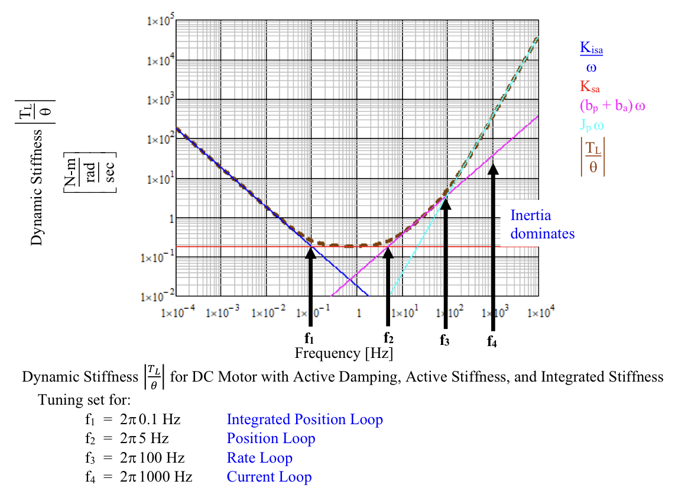
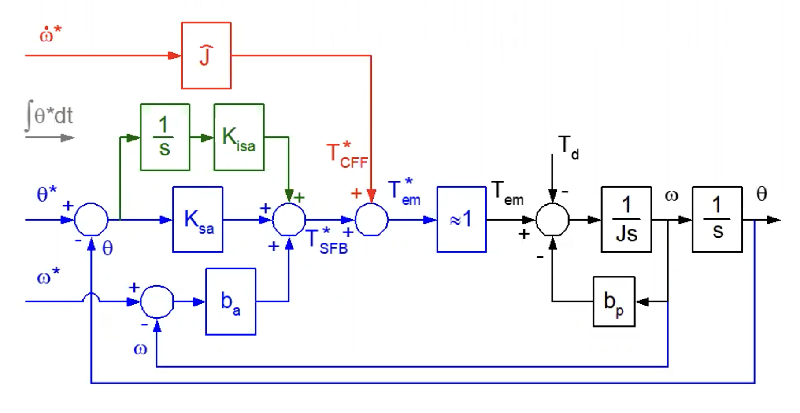

- [Dynamics of Controlled Systems](#dynamics-of-controlled-systems)
  - [Operating Point Analysis](#operating-point-analysis)
      - [Taylor Series Approximation](#taylor-series-approximation)
      - [Car Model:](#car-model)
  - [Dynamic Stiffness](#dynamic-stiffness)
    - [Decoupling](#decoupling)
      - [Proportional Plus Integral (PI) Control](#proportional-plus-integral-pi-control)
        - [Resonant Load Problem](#resonant-load-problem)
        - [Classical Industrial Motion Controller (Cascade Controller)](#classical-industrial-motion-controller-cascade-controller)
      - [Cross-coupled System](#cross-coupled-system)
  - [Command Tracking](#command-tracking)
    - [Tracking Error](#tracking-error)
    - [Command Feed Forward (CFF)](#command-feed-forward-cff)
  - [Mechanical Line Shift](#mechanical-line-shift)
# Dynamics of Controlled Systems

```diff
+ Class 1, Wed, Oct/3/2022
```
 

 

Mason's method?


```diff
+ Class 2, Mon, Oct/10/2022
```


## Operating Point Analysis

#### Taylor Series Approximation


$$\Delta \mathcal{F}(x) = \mathcal{F}(x) - \mathcal{F}(x_{op}) \cong \Delta x \cdot\mathcal{F'}(x_{op}) \qquad x = x_{op}+\Delta x$$

Neglects higher order terms, because the 1st derivative term can give a good proximation on $\Delta \mathcal{F}$

Example: Cos(x)


Multi-variable Operating System:


#### Car Model:

 \
 

Operating:


 \
 \


-3db

$x(t) = sin(2 \pi f_0 t) --> y(t) = 0.707sin(2 \pi f_0 t)$

-3db $\approx$ 0.5  &emsp; 0.707 $\approx$ 1/ $\sqrt{2}$


## Dynamic Stiffness

$$Dynamic Stiffness = \frac{Disturbance} {per \ unit \ response}$$

```diff
+ Class 3, Mon, Oct/17/2022
```

Virtue zero reference give the Steady State error to be zero

```diff
+ Class 4, Mon, Oct/24/2022
```
Steady State: The state when time go to infinity

Steady State error: $e_{ss} = \lim_{t \to \infty}e(t) = \lim_{s\to 0} sE(s)$ &emsp; (s = 0 in transfer function)

Manipulated Input Coupling System 

Lagrangian Solution:
L = T - V
T: Kinetic Energy （$T_e = \frac{1}{2}mv^2$) 动能
V: Potential Energy ($V_e = F*s$) 势能

### Decoupling
Decoupling:
让相互影响的输入项变成独立的



The $F_c$ and $T_c$ is what we want control, but it is not the real state in the real system. F and T are cross-coupled.




By decoupling $F_c^*$ is approximate to $F_c$ and not infused by another input $T_c$

```diff
+ Class 5, Mon, Oct/31/2022
```
$I = A I^* + B T$
the ideal of the control system is let the A = 1 which $I/I^* =1$ 

EMF decoupling ($\hat{K_e} = K_e$)

#### Proportional Plus Integral (PI) Control


```diff
+ Class 6, Mon, Dec/7/2022
```
Pole: if pole's are -a, -b, -c

the response will have 3 exponential terms: $k_1 e ^{-at} + k_2 e ^{-bt} + k_3 e ^{-ct}$


The pole at 1557Hz cause first response in red and the pole at 102Hz cause slow response in green.

The pair of poles with same real part will cause oscillation. Example: poles at $a+bs$ and $a-bs$


Adding integrated stiffness -> adds infinite static(f=0) stiffness



f in the stiffness bandwidth


##### Resonant Load Problem


```diff
+ Class 7, Mon, Dec/14/2022
```


##### Classical Industrial Motion Controller (Cascade Controller)

adv: the $\omega$ can be control and tuning or decoupling alone, for example, it can be decoupling the red box in figure then to make that $\omega \approx \omega^*$

#### Cross-coupled System
> Convection Oven Example (lecture)

Cross-coupled System是指一个系统有很多独立的相同的子系统并且会互相影响，可以通过decoupling消除子系统之间的影响使每一个子系统都成为一个相对独立的系统。


```diff
+ Class 8, Mon, Dec/21/2022
```

## Command Tracking

**For control system, there are two main things we want to achieve:**
* **Command Tracking** -> what we know
  * Let the real position of system following the command exactly ($x = x^*$)
* **Disturbance Rejection** -> what we don’t know (or choose not to model)
  * According to the Dynamic Stiffness

### Tracking Error 
Position Error = Command Position - Real Position ($\theta_e = \theta^* - \theta$)

Position Error = Tracking Error * Command Position + Dynamic Stiffness * Disturbance
($\theta_e$ = Tracking Error * $\theta^*$ + Dynamic Stiffness * $T_d$(or $T_L$)) *(d:Disturbance, L:Load)*


$$\text{Tracking Error} = | \frac{\theta_e}{\theta^*}|$$

* Tracking Error = 0: the system is following the command exactly
* Tracking Error = 1: the system is not following the command at all

Tracking Error is between 0 and 1, and it's better to be small.

### Command Feed Forward (CFF)

**Decoupling option:**
**Command Feed Forward Decoupling(CFFD):** Add decoupling gain to the command position
**State Feedback Decoupling(SFBD):** Using the real position feedback to decoupling. (sensor the real position)


各自的缺点
CFFD: If command position to the real position have the tracking error the CFFD can not perfect decoupling。
SFBD: 如果控制系统的sensor不能实时并且准确的检测系统的real position。呢么反馈后的decouple不准确会导致不能正确decouple

How to choose:
CFFD: 
* 工作的频率较小（Tracking Error很小）
* 不想加入sensor
SFBD：
* Sensor can track the real position really good (Sensor cannot track the position exactly in real world)

Because CFFD is the depend on the command position, so it almost don't have the phase shift.

Command tracking FRF: $\theta / \theta^*$


```diff
+ Class 9, Mon, Dec/28/2022
```

We still need the state feedback term because:
* we need reject the disturbance
* we don't have the optimal feed forward gain to all the things we need decoupling, so we still need to have the state feedback to fill the command we need.

And we cannot only use the state feedback because:
* The state feedback have the lag, every command need to wait until the position error ocurred



## Mechanical Line Shift
One motor carrie a line system have multiple mechanic in one line need control at same time