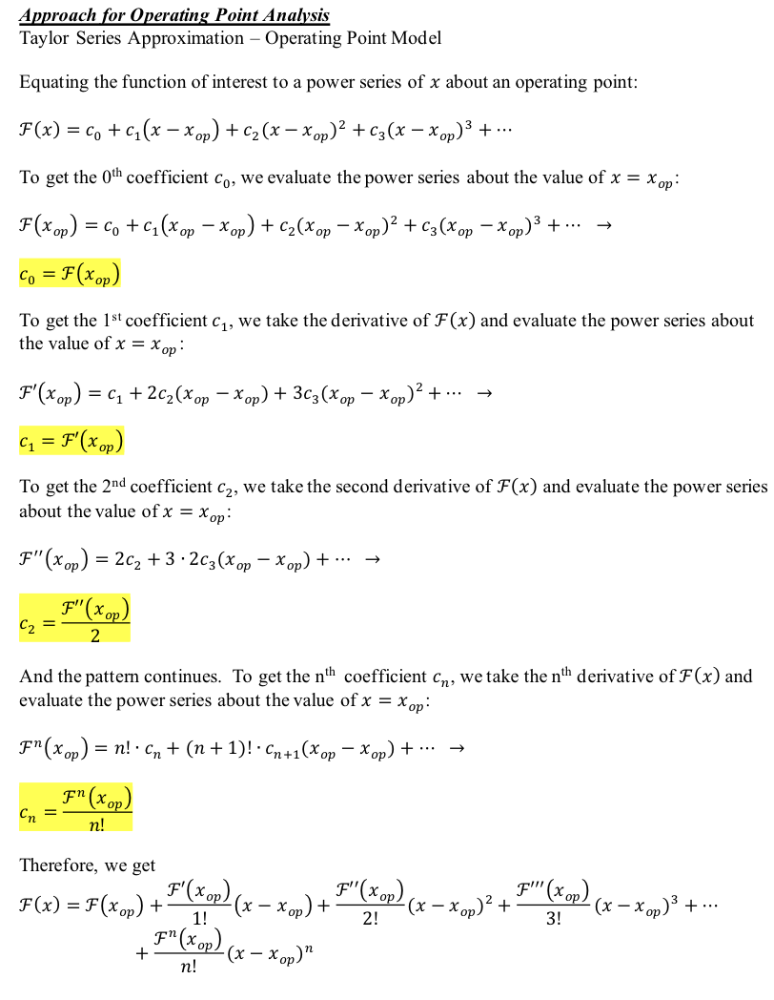
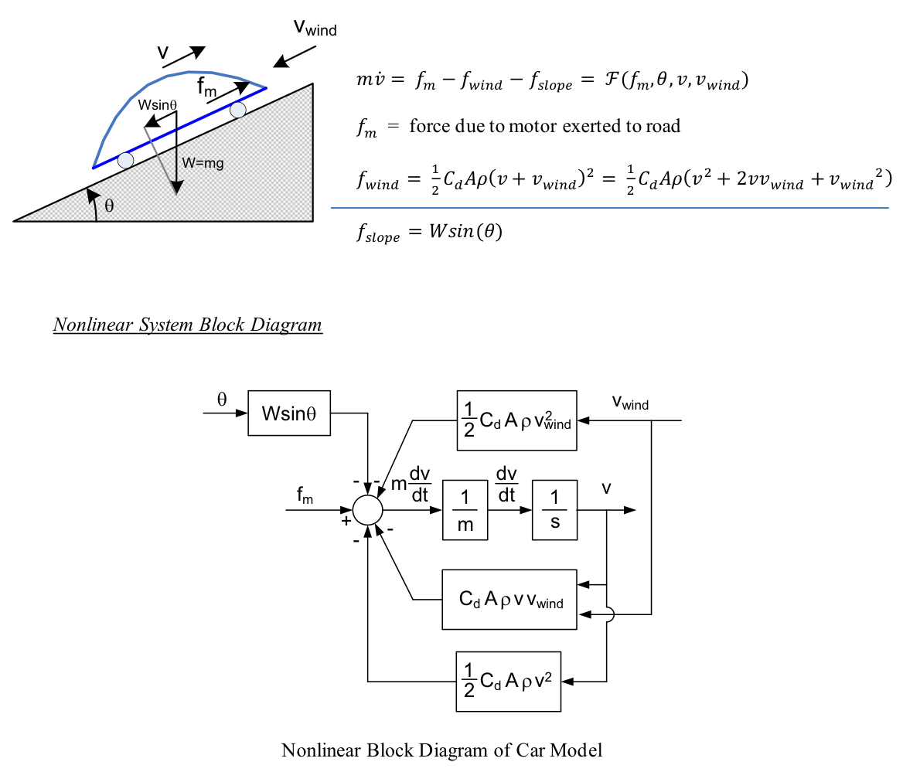
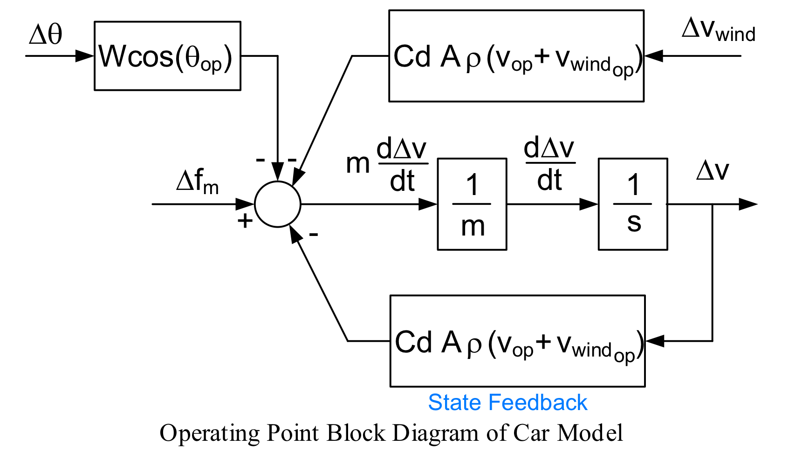

# Dynamics Of Controlled Systems

```diff
+ Week 1 Class 1, Wed, Oct/3/2022
```
 

 

Mason's method?

HW: Simulink symbolic


```diff
+ Week 2 Class 2, Mon, Oct/10/2022,
```

### Operating Point Analysis

#### Taylor Series Approximation




$$\Delta \mathcal{F}(x) = \mathcal{F}(x) - \mathcal{F}(x_{op}) \cong \Delta x \cdot\mathcal{F'}(x_{op}) \qquad x = x_{op}+\Delta x$$

Neglects higher order terms, because the 1st derivative term can give a good proximation on $\Delta \mathcal{F}$

Example: Cos(x)


Multi-variable Operating System:


#### Car Model:

 \
 

Operating:


 \
 \


-3db

$x(t) = sin(2 \pi f_0 t) --> y(t) = 0.707sin(2 \pi f_0 t)$

-3db $\approx$ 0.5  &emsp; 0.707 $\approx$ 1/ $\sqrt{2}$
