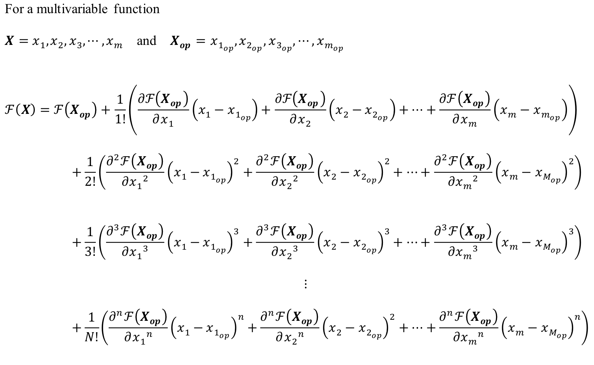
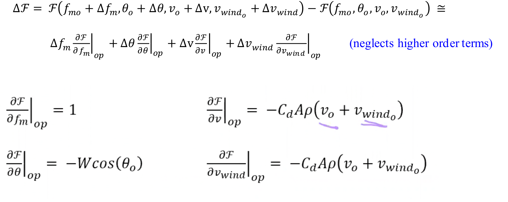
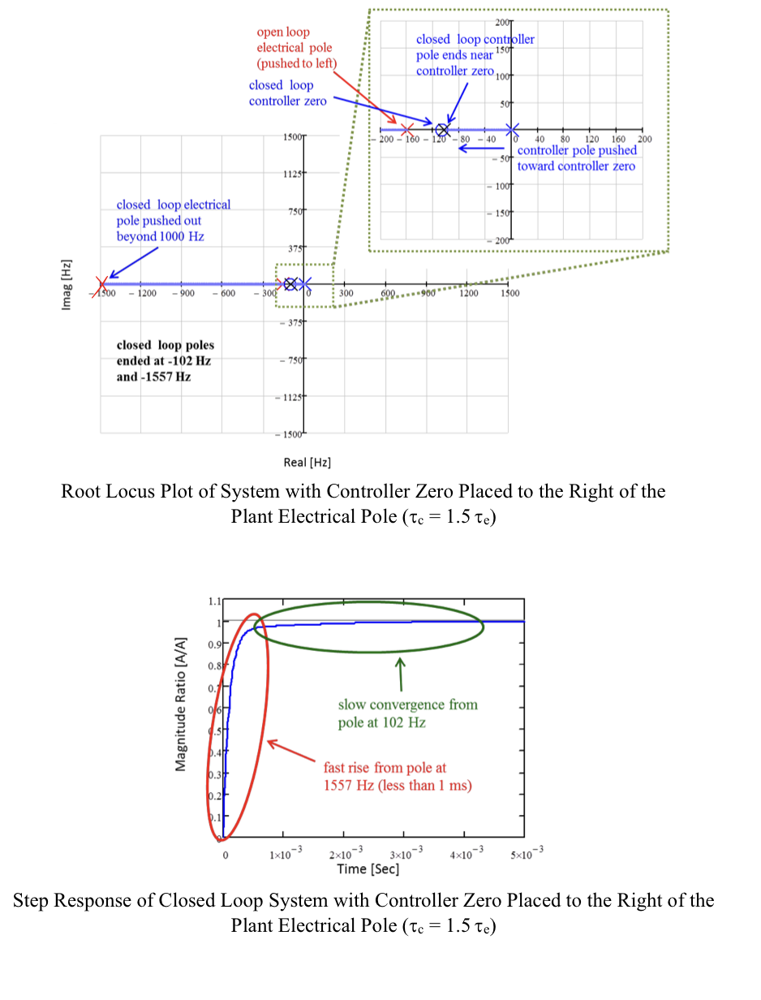
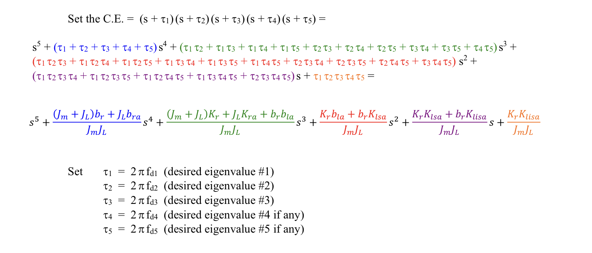
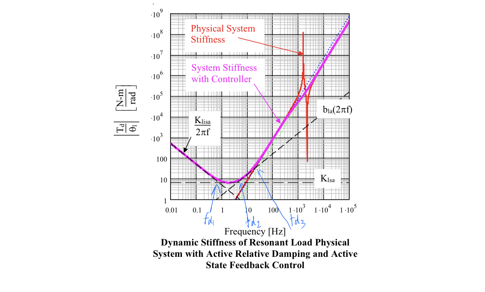

- [Dynamics Of Controlled Systems](#dynamics-of-controlled-systems)
    - [Operating Point Analysis](#operating-point-analysis)
      - [Taylor Series Approximation](#taylor-series-approximation)
      - [Car Model:](#car-model)
    - [Dynamic Stiffness](#dynamic-stiffness)
    - [Decoupling](#decoupling)
      - [Proportional Plus Integral (PI) Control](#proportional-plus-integral-pi-control)
        - [Resonant Load Problem](#resonant-load-problem)
# Dynamics Of Controlled Systems

```diff
+ Class 1, Wed, Oct/3/2022
```
 

 

Mason's method?

HW: Simulink symbolic


```diff
+ Class 2, Mon, Oct/10/2022
```


### Operating Point Analysis

#### Taylor Series Approximation


$$\Delta \mathcal{F}(x) = \mathcal{F}(x) - \mathcal{F}(x_{op}) \cong \Delta x \cdot\mathcal{F'}(x_{op}) \qquad x = x_{op}+\Delta x$$

Neglects higher order terms, because the 1st derivative term can give a good proximation on $\Delta \mathcal{F}$

Example: Cos(x)


Multi-variable Operating System:


#### Car Model:

 \
 

Operating:



 \
 \


-3db

$x(t) = sin(2 \pi f_0 t) --> y(t) = 0.707sin(2 \pi f_0 t)$

-3db $\approx$ 0.5  &emsp; 0.707 $\approx$ 1/ $\sqrt{2}$


### Dynamic Stiffness

$$Dynamic Stiffness = \frac{Disturbance} {per \ unit \ response}$$

```diff
+ Class 3, Mon, Oct/17/2022
```

Virtue zero reference give the Steady State error to be zero

```diff
+ Class 4, Mon, Oct/24/2022
```
Steady State: The state when time go to infinity

Steady State error: $e_{ss} = \lim_{t \to \infty}e(t) = \lim_{s\to 0} sE(s)$ &emsp; (s = 0 in transfer function)

Manipulated Input Coupling System 

Lagrangian Solution:
L = T - V
T: Kinetic Energy （$T_e = \frac{1}{2}mv^2$) 动能
V: Potential Energy ($V_e = F*s$) 势能

### Decoupling
Decoupling:
让相互影响的输入项变成独立的


The $F_c$ and $T_c$ is what we want control, but it is not the real state in the real system. F and T are cross-coupled.


By decoupling $F_c^*$ is approximate to $F_c$ and not infused by another input $T_c$

```diff
+ Class 5, Mon, Oct/31/2022
```
$I = A I^* + B T$
the ideal of the control system is let the A = 1 which $I/I^* =1$ 

EMF decoupling ($\hat{K_e} = K_e$)

#### Proportional Plus Integral (PI) Control


```diff
+ Class 6, Mon, Dec/7/2022
```
Pole: if pole's are -a, -b, -c

the response will have 3 exponential terms: $k_1 e ^{-at} + k_2 e ^{-bt} + k_3 e ^{-ct}$


The pole at 1557Hz cause first response in red and the pole at 102Hz cause slow response in green.

The pair of poles with same real part will cause oscillation. Example: poles at $a+bs$ and $a-bs$


Adding integrated stiffness -> adds infinite static(f=0) stiffness


f in the stiffness bandwidth



##### Resonant Load Problem


