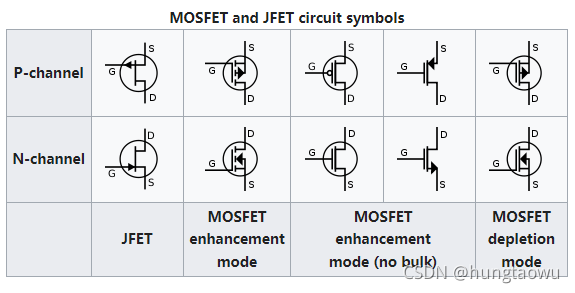

- [Basic Components](#basic-components)
  - [Resistor](#resistor)
  - [Capacitor](#capacitor)
    - [Application](#application)
  - [Inductor](#inductor)
  - [Diode](#diode)
    - [雪崩击穿和齐纳击穿](#雪崩击穿和齐纳击穿)
    - [TVS管 (Transient Voltage Suppressor)](#tvs管-transient-voltage-suppressor)
  - 
- [RLC Circuit](#rlc-circuit)
  - [Basic RLC](#basic-rlc)
    - [Resonate](#resonate)
  - [Frequency Filter](#frequency-filter)
    - [Low-Pass and High-Pass Filter](#low-pass-and-high-pass-filter)
    - [Band Pass and Band Stop Filter](#band-pass-and-band-stop-filter)
- [Bipolar Junction Transistors (BJT)](#bipolar-junction-transistors-bjt)
  - [NPN and PNP](#npn-and-pnp)
  - [Amplifier](#amplifier)
- [MOS](#mos)
- [电子原件](#电子原件)
  - [锁存器](#锁存器)
  - [隔离](#隔离)
    - [隔离电源模块](#隔离电源模块)
    - [数字隔离器](#数字隔离器)
  - [线性稳压器](#线性稳压器)
    - [PSRR(Power Supply Ripple Rejection)](#psrrpower-supply-ripple-rejection)

**Analog Circuit**

## Basic Components

### Resistor

### Capacitor

#### Application
> [电容在电路中的27种经典应用(知乎)](https://zhuanlan.zhihu.com/p/82664931)
> [VCC与GND之间的电容](https://zhuanlan.zhihu.com/p/550387466)

1. 稳压
2. 滤波：在直流电源（Vcc）和地之间并接电容的电容可称为滤波电容，滤波电容滤除电源的杂波和交流成分，压平滑脉动直流电，储存电能，取值一般 100－4700uF。

### Inductor

### Diode

> [PN结原理视频 (B站)](https://www.bilibili.com/video/BV1X44y1Y7nW/?spm_id_from=333.788&vd_source=bc1fa6dcfe143fdb1cf9fab62f9aae02)

电流方向是电子移动的反方向
PN结，电流从P到N导通。
P型区域含有有3价原子，具有空穴，会吸引电子。N型区域含有有5价原子，具有可移动自由电子
> [深入理解半导体：P型和N型的本质区别 (知乎)](https://zhuanlan.zhihu.com/p/626415128)

PN结的平衡状态：PN结中自由电子从N区移动到P区，中间会形成电子和空穴结合的掺杂区。但是移动也会使P区中电子浓度增高，形成反向电压排斥想要继续移动的电子。也就是内场反向电压。掺杂区反向电压增大与自由电子移动形成平衡。（平衡时仍然有自由电子在移动）
反向电压时，无法导通是因为PN结中的掺杂区变大，同时使PN结中掺杂区反向电压增大，形成壁垒

#### 雪崩击穿和齐纳击穿

#### TVS管 (Transient Voltage Suppressor)
瞬态电压抑制器，又称雪崩击穿二极管
[知乎](https://zhuanlan.zhihu.com/p/366516831)

tvs管是吸收浪涌功率用的，能在极短时间内承受反向电压冲击，使两极间的电压钳位于一个特定电压上，避免后面的电路受到冲击，过压保护

###

## RLC Circuit

### Basic RLC
[Series RLC](https://www.electronics-tutorials.ws/accircuits/series-circuit.html)

#### Resonate
The resonate frequency of CL circuit is:
$$f_0 = \frac{1}{2\pi \sqrt{L C}}$$

When resonate:
1. the series LC circuit will have infinity impedance,consider as **open circuit** (the current in LC loop is back-forth)
2. the parallel LC circuit will have 0 impedance, consider as **short circuit**

[Resonate Circuit](./CircuitDesign.md#resonate-circuit)

### Frequency Filter

#### Low-Pass and High-Pass Filter
Reluctance Frequency: $f_r = \frac{1}{2\pi \sqrt{RC}} = \sqrt{f_Hf_L}$

Inductor(L): Pass Low level frequency
Conductor(C): Pass High level frequency

#### Band Pass and Band Stop Filter

## Bipolar Junction Transistors (BJT)

可以近似看作两个二极管反向接。箭头为电流方向从P指向N。电子运动方向与电流方向相反。

NPN，Base 通入电流，P极中掺入电子，CB极P二极管导通，因为电压差

E极电子浓度大于C极，E极面积小于C极

> 三极管放大的物理原理：[PNP三极管（b站）](https://www.bilibili.com/video/BV1js4y1A7GU/?spm_id_from=333.788&vd_source=bc1fa6dcfe143fdb1cf9fab62f9aae02)

### NPN and PNP

base, collector, emitter

The arrow is current direction for emitter

Cutoff: $V_{BE} < 0.6, \ V_{CE} = V_{CC}, \ I_C = 0 $
Active: $V_{BE} \ge 0.6, \ 0 < V_{CE} < V_{CC}, \ I_C > 0 $
Saturation: $V_{BE} > 0.6, \ V_{CE} = 0 $

### Amplifier

## MOS

Current is from Drain to Source, 箭头方向是PN结方向，箭头所在位置是S

N-MOS is N-Channel, P-Mos is P Channel

NMOS反向通电相当于二极管，即使G极没有电压也可以直接导通

> 因为MOS管内部已经将S极和B极连在了一起，S极和P衬底是等电势的，我们加了Vgs电压就相当于在Vgb上加了一个电压。从NMOS管的结构来看，S极到D极是：N+（S）->P（B）->N+（D），现在S和B是短路的，那么S极到D极就变成了P（S/B）->N+（D），这个就是一个妥妥的二极管了（体二极管）。所以如果在Vds上加一个负电压，就算MOS管不打开，电流同样能够通过该体二极管流过。[MOS管打开时，是否正向和反向都能导通？(知乎)](https://www.zhihu.com/question/37879218/answer/2906877301)

## 电子原件

### 锁存器

锁存器可以使信号固定在一个状态，0或1
> [锁存器原理（知乎）](https://zhuanlan.zhihu.com/p/138572650)

LE (Latch Enable) :锁存使能，无效时输出不变化，维持原值。
OE (Output Enable) :输出使能，无效时输出为高阻态。

### 隔离

#### 隔离电源模块

#### 数字隔离器
在电气隔离器状态下实现数字信号传递

**光耦隔离**
optical coupler 

**容耦隔离**

**磁耦隔离**
磁耦是芯片级变压器隔离技术

### 线性稳压器

LDO（low dropout regulator，低压差线性稳压器）

#### PSRR(Power Supply Ripple Rejection)