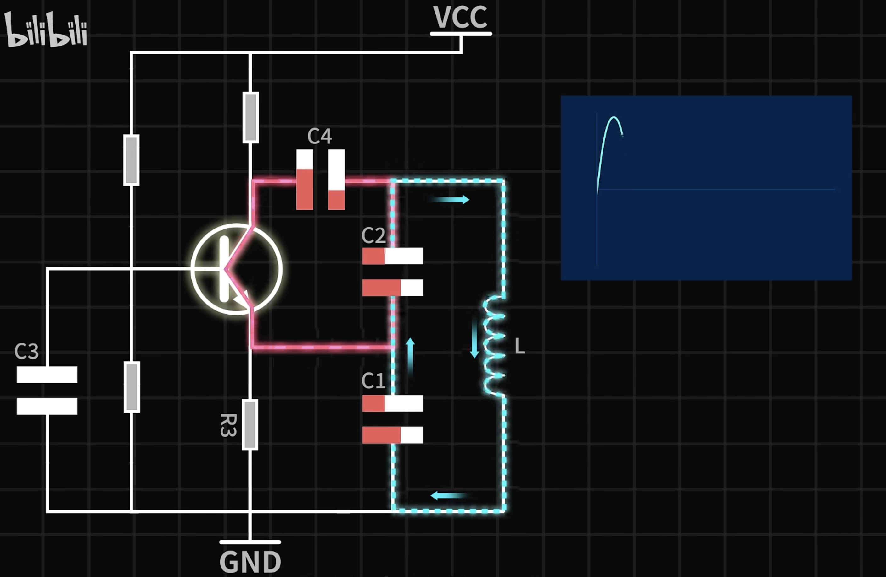
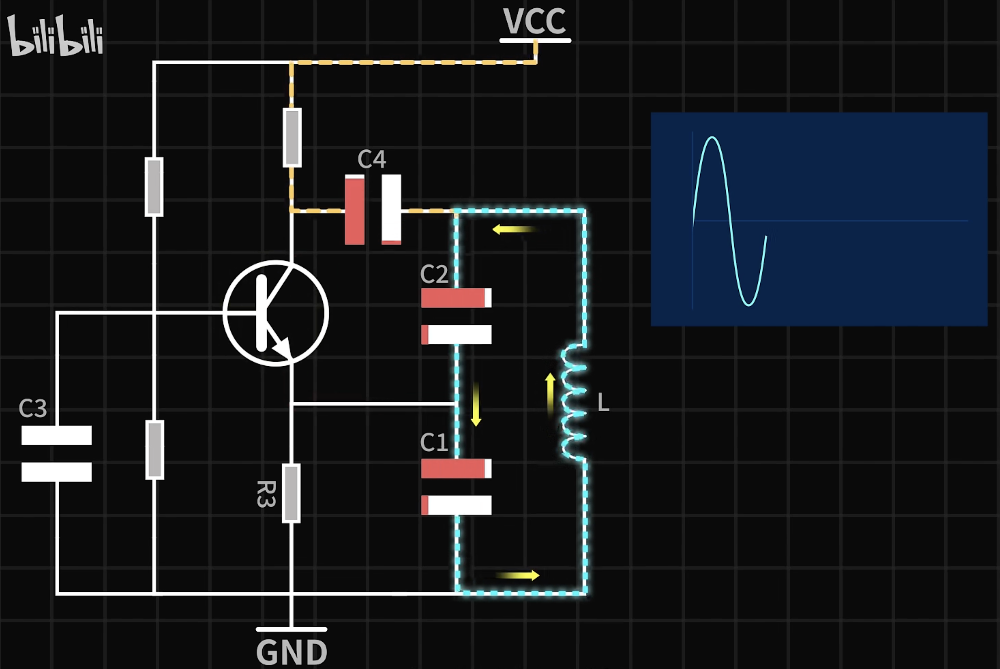

- [电路安全](#电路安全)
  - [EMC (Electromagnetic Compatibility) 电磁兼容性](#emc-electromagnetic-compatibility-电磁兼容性)
    - [浪涌](#浪涌)
- [Resonate Circuit](#resonate-circuit)
- [BJT](#bjt)
- [Check List](#check-list)

## 电路安全

### EMC (Electromagnetic Compatibility) 电磁兼容性

EMC分为EMS（electromagnetic susceptibility）电磁抗扰度和EMI（ Electromagnetic interference）电磁干扰两部分

#### 浪涌
接口处串联电阻：浪涌电流
接口处接TVS：浪涌电压

防爆安全-[安全栅](../Ex/IntrinsicSafety.md#安全栅)

## Resonate Circuit

 - | -
:-------------------------:|:-------------------------:
 | 

> [振荡电路原理（B站）](https://www.bilibili.com/video/BV1La4y1g7GC/?spm_id_from=333.788&vd_source=bc1fa6dcfe143fdb1cf9fab62f9aae02)

## BJT
base 和 be 之间加入电阻的作用：
1. R1和R2构成分压，可以用来限制在输入电压大于一定值时才使三极管导通。
2. 在输入电压为未知时，比如说单片机的IO为高阻态时，用R2下拉，使得三极管截止。

## Check List
current mirror

amplifying transconductance