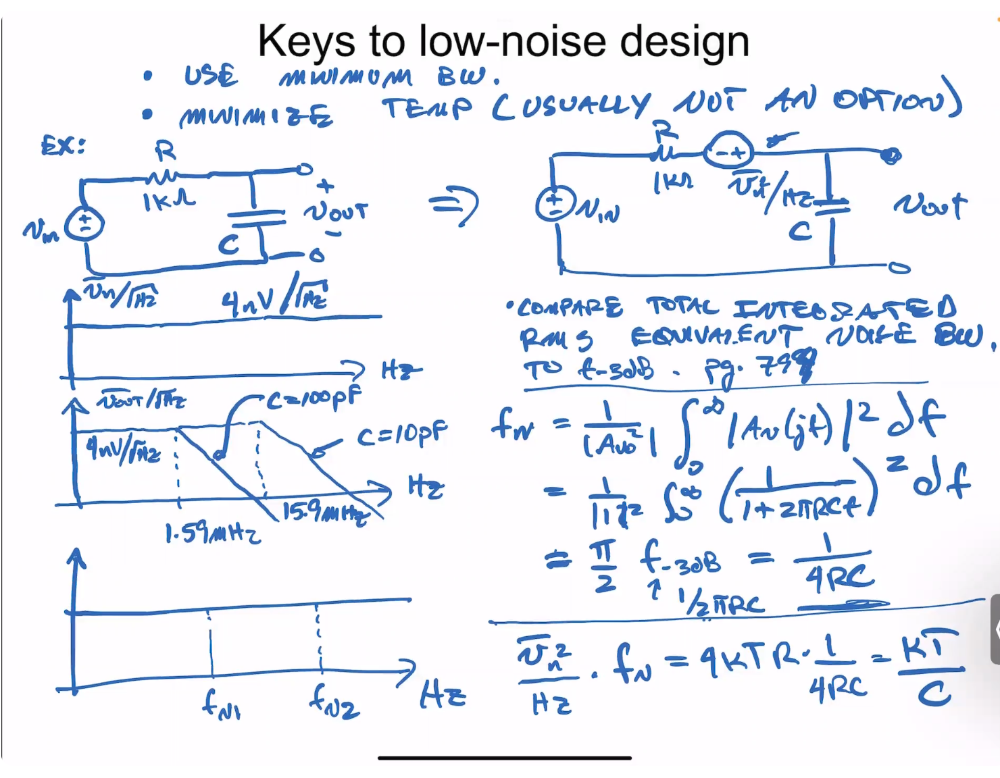

# E E 536 A Au 22: Design Of Analog Integrated Circuits And Systems


```diff
+ Week 1 Class 1, Thu, Sep/29/2022 
```


```diff
+ Week 2 Class 2, Tue, Oct/4/2022 
```

```diff
+ Week 2 Class 3, Tue, Oct/4/2022 
```

```diff
+ Week 3 Class 4, Tue, Oct/4/2022 
```

```diff
+ Week 3 Class 5, Tue, Oct/4/2022 
```

```diff
+ Week 4 Class 6, Tue, Oct/18/2022 
```

$\rho$: Correilation coefficient

$m_z = \alpha m_x \beta m_y$
if x and y are independent ($\rho$ = 0)
$$\sigma_z^2 - \alpha^2 \sigma_x^2 + \beta_y^2$$
In circuits:
- $\alpha$ and  $\beta$ often represent gain: $A_v, G_m, A_I$ etc.
- $\sigma_x$ and $\sigma_y$ represent $\bar{v_{rms}}$ or $i_{rms}$


$\widehat{v_n^2}$ (mean square noise voltage source) and $\widehat{i_n^2}$ mean square noise current source) are random variables.

$$\widehat{v_n^2} = 4KTR \cdot \Delta f$$ 

4KTR: Power spectral density ($\frac{v^2}{Hz}$)
Multiply all the bendwise of frequency $\Delta f$ to get power of all the noise

$$\widehat{i_n^2} = 4KT/R$$ 

K: Boltzmann's constant
T: Temp in K

at room temperature: $4KT = 1.66 * 10^{-20}$

$\frac{\widehat{v_n^2}}{\Delta f}$ (mean square noise voltage density)
$\frac{\widehat{i_n^2}}{\Delta f}$ mean square noise current density)

$\frac{\widehat{v_n}}{\sqrt{\Delta f}}$ : Root Mean Square(RMS) noise voltage, $1.26 \times 10^{-10} \sqrt{R} \ (\frac{v}{\sqrt{Hz}})$ in room temperature (T=300$^\circ$ K)


 

```diff
+ Week 4 Class 7, Tue, Oct/20/2022 
```


satu