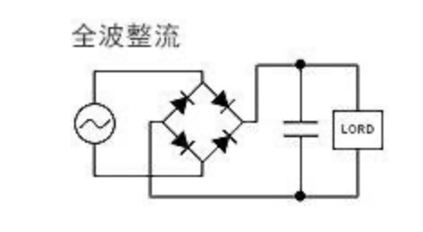
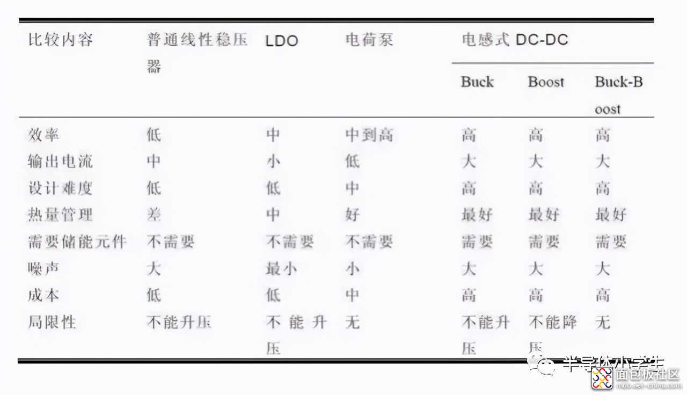
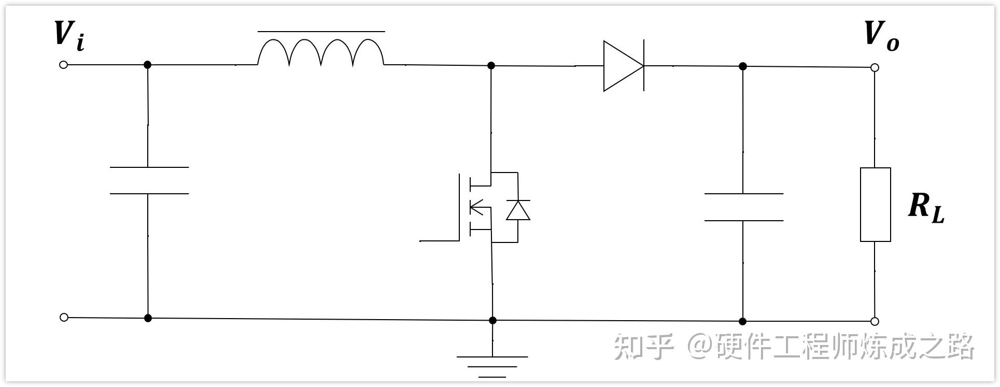
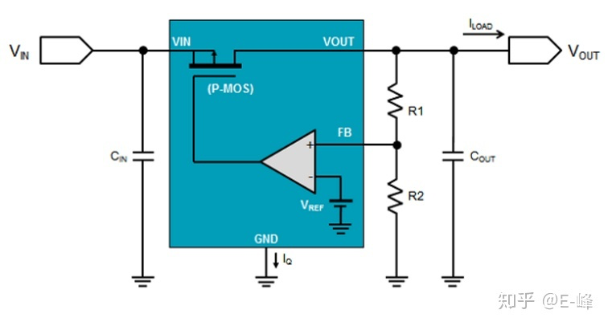
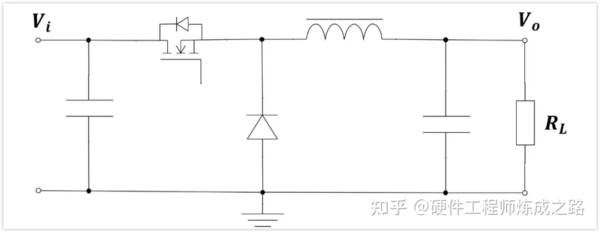

- [BJT](#bjt)
- [电源](#电源)
  - [AC-DC](#ac-dc)
  - [电压升降电路](#电压升降电路)
    - [升压电路](#升压电路)
      - [Boost](#boost)
    - [降压电路](#降压电路)
      - [LDO（low dropout regulator）](#ldolow-dropout-regulator)
        - [PSRR(Power Supply Ripple Rejection)](#psrrpower-supply-ripple-rejection)
      - [BUCK](#buck)
- [通讯电路](#通讯电路)
  - [I2C](#i2c)
- [电路安全](#电路安全)
  - [隔离](#隔离)
    - [隔离电源模块](#隔离电源模块)
    - [数字隔离器](#数字隔离器)
  - [EMC (Electromagnetic Compatibility) 电磁兼容性](#emc-electromagnetic-compatibility-电磁兼容性)
    - [浪涌](#浪涌)
- [干扰](#干扰)
  - [纹波](#纹波)
- [Resonate Circuit](#resonate-circuit)
- [传感器](#传感器)
    - [自动调零](#自动调零)
- [Check List](#check-list)
- [功率判断](#功率判断)
  - [负载损耗](#负载损耗)
  - [LDO](#ldo)
  - [DC-DC buck](#dc-dc-buck)

## BJT
base 和 be 之间加入电阻的作用：
1. R1和R2构成分压，可以用来限制在输入电压大于一定值时才使三极管导通。
2. 在输入电压为未知时，比如说单片机的IO为高阻态时，用R2下拉，使得三极管截止。

## 电源

### AC-DC

### 电压升降电路

#### 升压电路

##### Boost

> [手撕Boost！Boost公式推导及实验验证 (知乎)](https://zhuanlan.zhihu.com/p/396048467)

通过开关来实现电感的充电放电，加大电压。开关闭合，电感充电；开关断开，电感放电，电压等于电感电压与电源电压的和。后置的电容也通过充电放电维持电压的稳定。

#### 降压电路

##### LDO（low dropout regulator）

低压差线性稳压器

LDO核心架构：P-MOS+运放，通过芯片内部已经设置好的电阻来达到调节P-MOS的输出，而得到该芯片的输出电压。
LDO工作原理就一句话：通过运放调节P-MOS的输出。

LDO重要参数：
1. 压差：输入电压需大于输出电压且大于最小压差
2. 裕量电压：裕量电压是指 LDO 满足其规格所需的输入至输出电压差
3. 效率：LDO 的效率由接地电流和输入/输出电压确定
$$P = I_{OUT}/(I_{OUT}+I_{GND})\times V_{OUT}/V_{IN}\times 100\% $$

在大多数应用中,LDO 主要用于将灵敏的负载与有噪声的电源相隔离。与开关稳压器不同,线性稳压器会在通路晶体管或MOSFET(用来调节和保持输出电压来达到所需的精度)中造成功率耗散。因此,就效率而言,LDO 的功率耗散会是一个显著劣势,并可能导致热问题。所以, 设计工程师需要通过尽可能降低 LDO 功率耗散,来提升系统效率和避免热复杂性,这一点很重要。

###### PSRR(Power Supply Ripple Rejection)
电源纹波抑制比

##### BUCK

## 通讯电路

### I2C
I2C的输入输出结构采用的是开漏的结构

I2C总线可能连接多个设备，推挽输出可能有干扰

1、给I/O确定的电平，不易受外界干扰；
2、接上拉的开漏输出结构可以作为外部的输入I/O。

## 电路安全

### 隔离

#### 隔离电源模块

#### 数字隔离器
在电气隔离器状态下实现数字信号传递

**光耦隔离**
optical coupler 

**容耦隔离**

**磁耦隔离**
磁耦是芯片级变压器隔离技术

### EMC (Electromagnetic Compatibility) 电磁兼容性

EMC分为EMS（electromagnetic susceptibility）电磁抗扰度和EMI（ Electromagnetic interference）电磁干扰两部分

#### 浪涌
接口处串联电阻：浪涌电流
接口处接TVS：浪涌电压

防爆安全-[安全栅](../Ex/IntrinsicSafety.md#安全栅)

## 干扰

### 纹波
> [理解输出电压纹波和噪声一：输出电压纹波来源和抑制](https://e2echina.ti.com/blogs_/b/power_house/posts/53234)

## Resonate Circuit

 - | -
:-------------------------:|:-------------------------:
 | 

> [振荡电路原理（B站）](https://www.bilibili.com/video/BV1La4y1g7GC/?spm_id_from=333.788&vd_source=bc1fa6dcfe143fdb1cf9fab62f9aae02)

## 传感器
#### 自动调零

## Check List
current mirror

amplifying transconductance

## 功率判断

### 负载损耗
上电顺序

### LDO
电流 温度 

### DC-DC buck
内部mos 三极管导通损耗 电容损耗 （效率约为80%）

[BUCK PCB Design](HWProjectDesign/PCBDesign.md#buck)