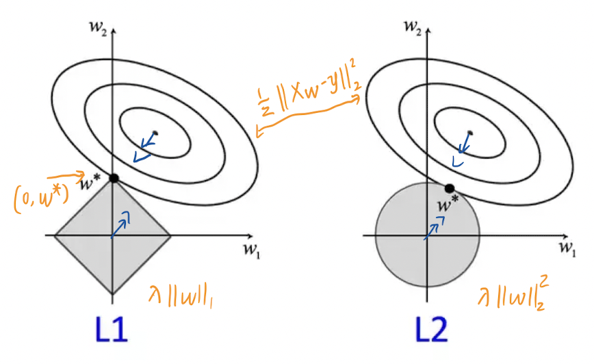

- [adv](#adv)

```diff
+ Class 1.1
```

# Intro

Supervised Learning: give the object name

Unsupervised Learning: don't give the object name, Machine don't know what it is, only know if there have two objects are different.

# Data Pre-progress 
1. Take care of Noise
2. Missing Values
3. Normalize attribute:
   > 面积大，bedroom小，为了使平等，normalize所有data使其拥有相同的权重，例如把所有data normalize 到=1到1

   > Mean Normalization:
   X = (X – column_mean) / (column_max – column_min)
   (For Linear model, usually do mean normalization for all contribute)

Normal Equation:


# Valudation
## K-fold Cross Validation

# Linear Regression

## Regression Function
### Objective (Loss) Function


Loss = 
$$||y- \hat{y}||^2_2 = \sum(y_i  - \hat{y}_i)^2 $$
$$ \hat{y}_i = \hat{w}^Tx_i $$

<br>

### Lasso: 
($l_1$ Regularization)

Benefits: Removes un-important features, sparse the function

loss part + regularization part

<br>

### Ridge: 
($l_2$ Regularization)


 $||w||_2^2 = w_1^2 + w_2^2 + ...$

Benefits: No larger weights

<br>

### L1 and L2



At the point $(0,w^*)$, the $w_1 = 0$, that means this Lasso function ignored the $x_1$ contribution *$(w_1x_1 = 0)$*, that's how $l_1$ removes un-important features.

### Elastic Net:


## Operation
numerical value

categorical value

```diff
+ Class 2.2
```
## Gradient Decent

### Batch Gradient Descent

### Mini-batch SGD

### Stochastic gradient descent


# Classfication

## Linear Separability
(only one using linear decision boundary)
Linear Separability: logistic regretion; SVM

> Non-linear Separability: Deep Learnig; Random Forest

### Logistic Regretion

Sigmoid Function (logistic function)

Where 
$$ y = w^Tx_i $$ 

```diff
- 所有ML模型问题的根本就是让你的模型中的Loss尽可能的small。越小就越贴近于真实值。 所有的Loss function 都是covers function. covers function的简单解释是有可以趋向的最小值。例如 y=x^2 的形状 (y可以趋向于0）。所以loss可以趋向于一个min值。 
```

```diff
+ Class 3.1
```


Logistic Regression Loss:
*LR Loss* or *log Loss* or *Binary cross-entropy loss*

### Probability of Class

## Evaluating Classifiers


### Features for Text Data
Bag of word

```diff
+ Class 3.2
```

#### TF-IDF
(term frequency-inverse document frequency)


#### Data Pre-processing
NLTK

## Decision Trees

### Trees
#### Split Selection

#### Information Gain(ID3)
IG = Entropy(Parent) - werighted_avg * Entropy(Children)

#### Information Gain Ration(C4.5)

#### Gini Index(CART)

### Prevent Overfit

#### Stopping Criteria (Pre pruning)
- Maxdepth reached
- Num_samples in node is small enough
- Information Gain is smaller than a threshold
#### Post Pruning
Grow the trees to the maximum
Cut the tree subtrees that have lowerst classfication error on pruning set(validation set)

### Image Processing

RGB HSV
#### Image Feature Extractor+Descriptors, SIFT
- Keypoint detection + Feature descriptors 

## Random Forests
Sample data with same features to have same tress.


sigmoid function : binary-class

multi-class: soft-max function

