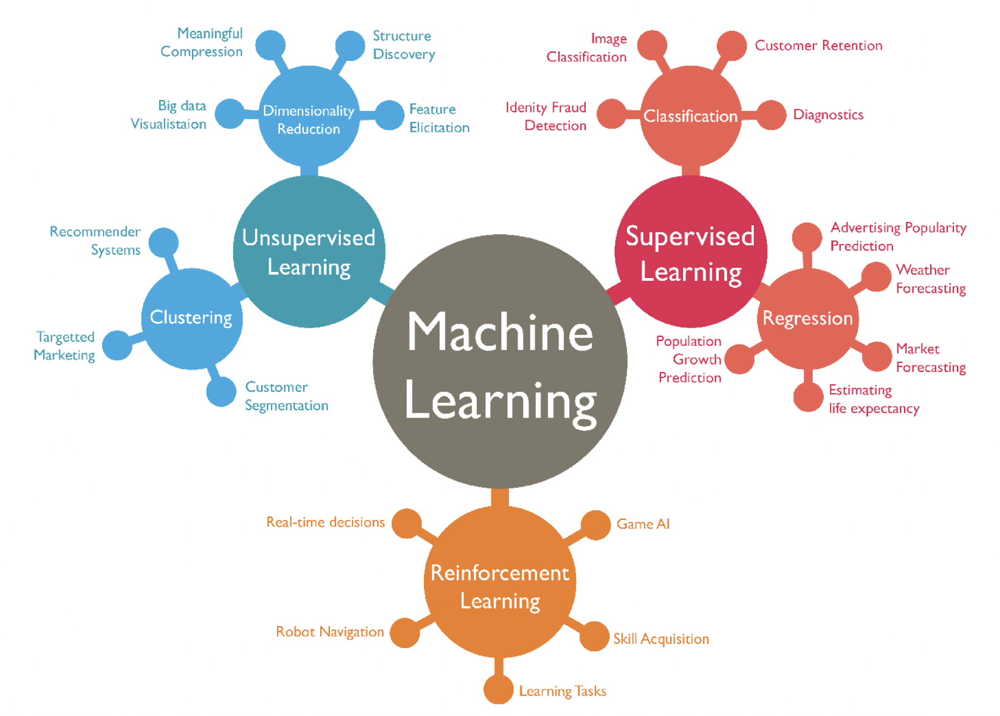
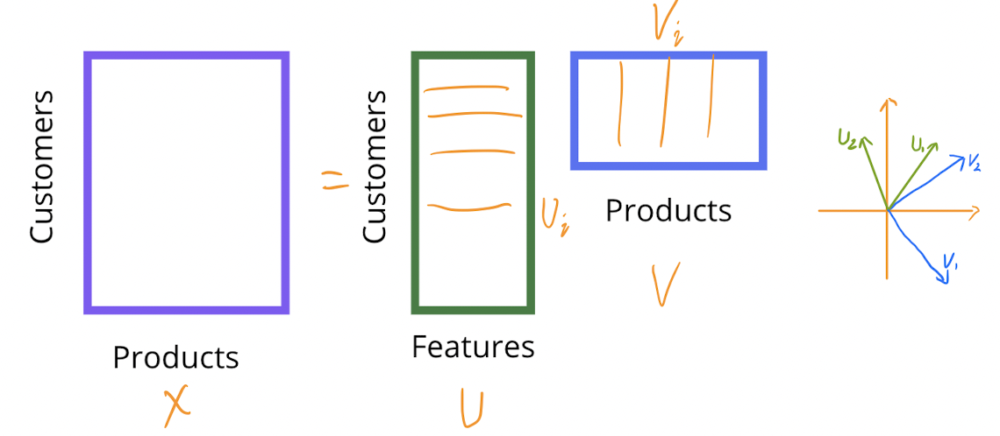
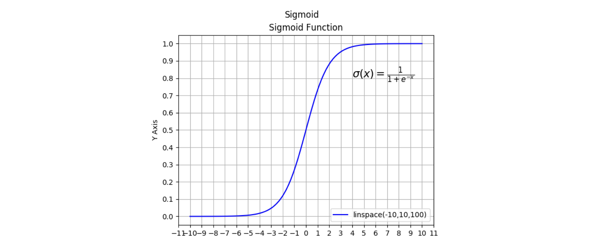
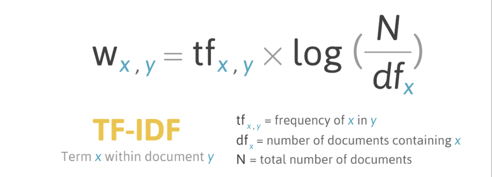
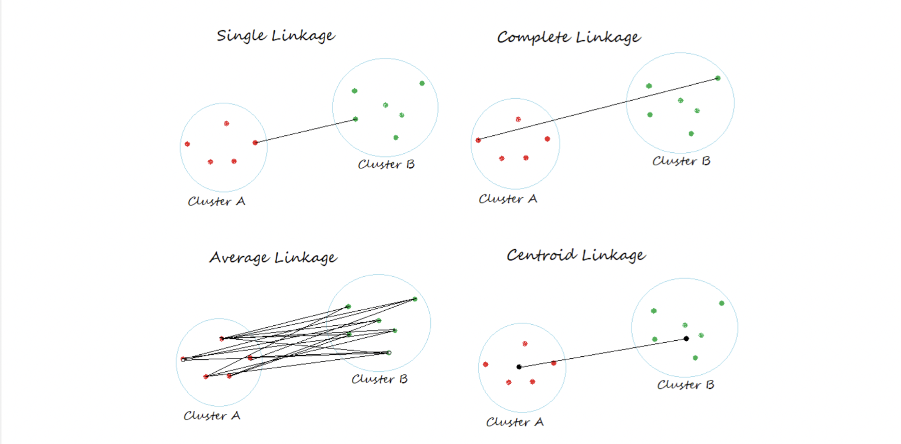

- [Intro](#intro)
- [Dimensionality Reduction](#dimensionality-reduction)
    - [SVD (Singular Value Decomposition)](#svd-singular-value-decomposition)
    - [PCA (Principal Components Analysis)](#pca-principal-components-analysis)
    - [Word2Vec](#word2vec)
      - [Skip Gram Model](#skip-gram-model)
- [Supervised Learning](#supervised-learning)
  - [Data Pre-progress](#data-pre-progress)
  - [Valuation](#valuation)
    - [K-fold Cross Validation](#k-fold-cross-validation)
  - [Linear Regression](#linear-regression)
    - [Regression Function](#regression-function)
      - [Objective (Loss) Function](#objective-loss-function)
      - [Lasso:](#lasso)
      - [Ridge:](#ridge)
      - [L1 and L2](#l1-and-l2)
      - [Elastic Net:](#elastic-net)
    - [Operation](#operation)
    - [Gradient Decent](#gradient-decent)
      - [Batch Gradient Descent](#batch-gradient-descent)
      - [Mini-batch SGD](#mini-batch-sgd)
      - [Stochastic gradient descent](#stochastic-gradient-descent)
  - [Classification](#classification)
    - [Linear Separability](#linear-separability)
      - [Logistic Regression](#logistic-regression)
      - [Probability of Class](#probability-of-class)
    - [Evaluating Classifiers](#evaluating-classifiers)
      - [Features for Text Data](#features-for-text-data)
        - [TF-IDF](#tf-idf)
        - [Data Pre-processing](#data-pre-processing)
    - [Decision Trees](#decision-trees)
      - [Trees](#trees)
      - [Prevent Overfit](#prevent-overfit)
        - [Stopping Criteria (Pre pruning)](#stopping-criteria-pre-pruning)
        - [Post Pruning](#post-pruning)
      - [Image Processing](#image-processing)
        - [Image Feature Extractor+Descriptors, SIFT](#image-feature-extractordescriptors-sift)
    - [Random Forests](#random-forests)
    - [Soft-Max](#soft-max)
- [Un-supervised Learning](#un-supervised-learning)
  - [Clustering](#clustering)
    - [K-means](#k-means)
      - [Loss Function](#loss-function)
      - [K-means++](#k-means-1)
    - [t-SNE](#t-sne)
    - [Hierarchical Clustering](#hierarchical-clustering)
      - [Divisive (top-down)](#divisive-top-down)
      - [Agglomerative (bottom-up)](#agglomerative-bottom-up)
        - [Dunn Index](#dunn-index)
  - [Anomaly Detection](#anomaly-detection)
    - [GMM ??](#gmm-)
    - [Time-series Anomaly Detection](#time-series-anomaly-detection)
    - [Anomaly Type](#anomaly-type)
    - [Method](#method)
    - [Simple Moving Average (SMA)](#simple-moving-average-sma)
    - [Exponential Moving Average (EMA)](#exponential-moving-average-ema)
    - [STL](#stl)
  - [Deep Learning:](#deep-learning)
    - [Intro](#intro-1)
      - [Multi-Layer Perception (MLP)](#multi-layer-perception-mlp)
    - [Over-Fitting](#over-fitting)
    - [Forward Propagation](#forward-propagation)
    - [Back Propagation](#back-propagation)
    - [Auto Encoder *](#auto-encoder-)
    - [Sparse Auto Encoders](#sparse-auto-encoders)
    - [Sequence to Sequence Model (LSTM)](#sequence-to-sequence-model-lstm)
    - [NLP](#nlp)
      - [Document Summarization](#document-summarization)
      - [Evaluation](#evaluation)
```diff
+ Class 1.1
```

# Intro
ML:


ML Pipeline:


**Supervised Learning:** give the object name

**Unsupervised Learning:** don't give the object name, Machine don't know what it is, only know if there have two objects are different.


**Parameter and Hyper-parameter**
- Hyper-parameter is what we supply to the mode and which cannot learn from the ML model.
  >Examples: number of hidden Nodes and Layers,input features, Learning Rate, Activation Function etc in Neural Network*
- Parameter is what model learning for.


# Dimensionality Reduction

```diff
+ Class 5.2
```

- Classical Lineal
  - SVD
  - PCA
  - LDA (Linear di)
- Nun-lineal
  - Auto-Encoders
  - word2vec (word embeddings)
  - BERT (sentence embedding)
  - CNN architecture (Image embedding)

### SVD (Singular Value Decomposition)
Split the data in dataset and use number of matrix to represent, each matrix represent a dimension. It is bi-linear model 
$$X = U \Sigma V^T$$
$X$: Data Matrix (Nxd)
$\Sigma$: Scaling Matrix, it make sure the function can operation if $X$ is not normalized (Diagonal Matrix)
$U$ and $V$ are (Orthogonal matrix, example: $U_i$ and $U_j$ have same magnitude but direction is orthogonal in $\R^n$ dimension)
 

Using Matrix Factorization

Split the customers and products into two Matrix and use a vector to represent each customers and products.

### PCA (Principal Components Analysis)

**Principal Component: $V$**
It is based on SVD. Help understand the variance.
$$X^TX = V \Sigma^2 V^T$$

$X^TX = (V \Sigma U^T)(U \Sigma V^T) = V \Sigma^2 V^T$

$V$ is $d \times k$ , each colum of $V$ is a principal component.

**The Projection of Data:$V^T X^T$**
The $V^T X^T$ is represents the embeddings or compressed representation of the data points. It is also equal to $\Sigma U^T$

The dimention of $X^T$ is $d \times N$, then the dimention of $V^TX^T$ is $k \times N$, so this embedding the function of samples from d to k.

Here is a two demention example:

The line is a principal component *(a colum $V_i$ in $V$)*. The points is functions. The projection will make the points in 2d demention embedding to the line, which is 1d demention.

**Reconstruction**

### Word2Vec
Non-linear Model
#### Skip Gram Model
semi-supervised learning


# Supervised Learning
## Data Pre-progress 
1. Take care of Noise
2. Missing Values
3. Normalize attribute:
   > 面积大，bedroom小，为了使平等，normalize所有data使其拥有相同的权重，例如把所有data normalize 到=1到1

   > Mean Normalization:
   X = (X – column_mean) / (column_max – column_min)
   (For Linear model, usually do mean normalization for all contribute)

Normal Equation:


## Valuation
### K-fold Cross Validation

## Linear Regression

### Regression Function
#### Objective (Loss) Function


Loss = 
$$||y- \hat{y}||^2_2 = \sum(y_i  - \hat{y}_i)^2 $$
$$ \hat{y}_i = \hat{w}^Tx_i $$

<br>

#### Lasso: 
($l_1$ Regularization)

Benefits: Removes un-important features, sparse the function

loss part + regularization part

<br>

#### Ridge: 
($l_2$ Regularization)


 $||w||_2^2 = w_1^2 + w_2^2 + ...$

Benefits: No larger weights

<br>

#### L1 and L2


At the point $(0,w^*)$, the $w_1 = 0$, that means this Lasso function ignored the $x_1$ contribution *$(w_1x_1 = 0)$*, that's how $l_1$ removes un-important features.

#### Elastic Net:


### Operation
numerical value

categorical value

```diff
+ Class 2.2
```
### Gradient Decent

#### Batch Gradient Descent

#### Mini-batch SGD

#### Stochastic gradient descent


## Classification

### Linear Separability
(only one using linear decision boundary)
Linear Separability: logistic regression; SVM

> Non-linear Separability: Deep Learning; Random Forest

#### Logistic Regression

Sigmoid Function (logistic function)

Where 
$$ y = w^Tx_i $$ 



```diff
- 所有ML模型问题的根本就是让你的模型中的Loss尽可能的small。越小就越贴近于真实值。 
- 所有的Loss function 都是covers function. covers function的简单解释是有可以趋向的最小值。
- 例如 y=x^2 的形状 (y可以趋向于0）。所以loss可以趋向于一个min值。 
```

```diff
+ Class 3.1
```


Logistic Regression Loss:
*LR Loss* or *log Loss* or *Binary cross-entropy loss*

#### Probability of Class

### Evaluating Classifiers


#### Features for Text Data
Bag of word

```diff
+ Class 3.2
```

##### TF-IDF
*(Term Frequency - Inverse Document Frequency)*

Find the importance of every word.

##### Data Pre-processing
NLTK

### Decision Trees

#### Trees
- Split Selection
- Information Gain(ID3)
IG = Entropy(Parent) - werighted_avg * Entropy(Children)
- Information Gain Ration(C4.5)
- Gini Index(CART)

#### Prevent Overfit

##### Stopping Criteria (Pre pruning)
- Maxdepth reached
- Num_samples in node is small enough
- Information Gain is smaller than a threshold
##### Post Pruning
Grow the trees to the maximum
Cut the tree subtrees that have lowerst classfication error on pruning set(validation set)

#### Image Processing

RGB HSV
##### Image Feature Extractor+Descriptors, SIFT
- Keypoint detection + Feature descriptors 

```diff
+ Class 4.1
```

### Random Forests
Sample data with same features to have same tress.

### Soft-Max
Sigmoid function *(binary-class)* &emsp; --> &emsp; Soft-Max function *(multi-class)*

Sigmoid function:
$$\sigma(z) = \frac{1}{1+e^{-z}}$$

Probability of kth class
$$\hat{y}^i_k = \sigma(z)_k = \frac{e^{z_k}}{\sum _j e^{Z_j}}$$

# Un-supervised Learning
## Clustering
The difference between clsfication problem and clustering problem is: In classfication problem, we have x and y, and predict x to the y lable. In lustering problem, we only have x, the target is group x to some parts, each part reprensent different term.

```diff
+ Lecture 4.2
```

### K-means
K-means assume there are some centrol points in every group, then assign each point to differnt centrol points.

#### Loss Function
$$min_{C,A} \ \ ||X-AC||^2_F $$
X: Data Matrix ($N \times d$)&emsp; &emsp; 
A: Argument Matrix ($N \times k$) &emsp; &emsp; (represent which k is the point belong to)
C: Centroid Matrix ($k \times d$) &emsp; &emsp; *(Evey row in C represent a centrol point. k number of points total)*

A and C is not give initially. The k-mean algorithm will predicte both A and C.

If the data is hard choise, the every row in A has only one "$1$" and other is "$0$"

> Hard choise: only one answer for each data. (1 hot endcoding)
> Soft choise: data may have mutible answer with different probabilities. (sum to 1)

**Iteration:** K+means algorithms will fix one of $A$ or $C$ first. Let's say fix $A$ first, so we have $A^0$, from $A^0$ it can predicate $C^0$. Then from $C^0$ to predicate $A^2$, etc... from $^j$ to predicate $A^{j+1}$ *($j+i$ iteration)*... Untill find the best.

The overall computatinal complexity is $O(Nkd)$ for one iteration.

#### K-means++
Choose a point to be the centroid, find the distance from all other points and chose anther centroid in a cluster with most father distance from the closet centroid untill find k centroids.
The computational complex for find each centroid here is $O(Nkd)$
It's better than k-means with better starting points but more time.


```diff
+ Class 5.1
```

### t-SNE
[Coding reference](https://www.kaggle.com/jeffd23/visualizing-word-vectors-with-t-sne/notebook)


y is the embedded data in lower dimensions.

KL Divergence: Distance Measure for Probabilities
$$KL(p||q) = \sum ^d_{i=1} p_i log \frac{p_i}{q_i}$$

This function will learn y.

> ### Mixture Models
> soft clustering. GMM + k-means
> 
### Hierarchical Clustering
Dendrograms

#### Divisive (top-down)
like k-means, arleady have k clusters, then sign every points to one of the  k clusters.

#### Agglomerative (bottom-up)  
1. begin with every point is a cluster
2. merge smallest Signgle linkage between two clusters 

> ##### Linkage
> 

##### Dunn Index

Inter-cluster distance: distance between points from two cluster
Intro-cluster distance: distance between points from one cluster

The bigger dunn indes ususlly is a better result. 


```diff
+ Class 6.1 2/7
```


## Anomaly Detection
### GMM ??
- **Probability Density Function (PDF)**
$$ \sum ^K_{k=1} \pi _k N(x| \mu_k, \Sigma_k) $$


- **Likehood function**


- **Loss Function**


If there is point in data set, and the probability of this point $< \alpha$, this point is anomaly.

### Time-series Anomaly Detection

Use linear regression

```diff
+ Class 6.2 2/9
```
### Anomaly Type
- Point Anomaly
- Contextaul Anomaly
- Collective Anomalies (E.g. Arrhythmia)

### Method
- Mean/Std Deviation
  - Cannot handle trend
- Supervised Learning
Use unsupervised learning features
- Simple Moving Average (SMA)
- Exponential Moving Average (EMA)
- STL
- Deep Learning 
- Auto Regression
  - ARIMA / ARMA  

### Simple Moving Average (SMA)
[Github Example](https://github.com/HamishWoodrow/anomaly_detection)
N-SMA is the N moving average
$$SMA(i) = \frac{1}{N}\sum^{i-1}_{j=i-50} x_j$$
Deviation$(i) = d(i) = |(x_i - SMA(i))|$
Standard Deviation:
$$SD(i) =  \sqrt{\frac{\sum^{N-1}_{j=0}d^2(j-i)}{N}} $$ 

$x_i$ is an anomaly if $|x_i - SMA(i)| > t*SD(i)$

$$Nvar(i) = \sum^{N-1}_{j=0}(x_{i-j}-SMA(i-j))^2$$

### Exponential Moving Average (EMA)
$$ EMA(i) = (1- \beta) * EMA(i-1) + \beta *x_i$$
$\beta$ is parameter, where $0 \le \beta \le 1$

$x_i$ is an anomaly if $||EMA(i) - x_i|| $

### STL
Data = Seasonal + Trend + Remainder

Two STL:
- Data = S + T + L
- Data = S * T * L
  log(Data) = losS + logT + logL

```diff
+ Class 7.1 2/14
```

## Deep Learning:
### Intro
Application:


**Activation Function**
- Sigmoid
- Hyperbolic tangent
- Rectified linear unit (ReLU)
- Softplus
#### Multi-Layer Perception (MLP)

### Over-Fitting

1. Weight Regularization $l_1$, $l_2$
2. Dropouts (popular)
   
3. Early Stoppoint
   Stop training when the validation error start increasing


```diff
+ Class 7.2 2/16
```

### Forward Propagation
$x$ -> $\hat{y}$

### Back Propagation
- Compute gradient
- Chain rule for differentiation

### Auto Encoder *
PCA and Auto-Encoders are embedding
PCA: Linear
AE: Non-linear

Application:
- Remove Obstacles
- Coloring Images

### Sparse Auto Encoders

### Sequence to Sequence Model (LSTM)
LSTM: Long Sort Term Memory
LSTM is used on the sequence data, carry the previous context/weightvectrx through sequence to the present.

Application:
NLP

```diff
+ Lecture 14, Week 8, 2/23
```
### NLP

**Application:**
- Topic Modeling
- Translation
- Sentiment Analysis
- Chat bots
- Document Summarization
  - Abstractive Summarization
  - Extractive Summarization

#### Document Summarization

**Evaluation Metrics**
1. ROUGE score: Recall-Oriented Understudy for Gisting Evaluation
2. ROUGE-N : N-gram overlap between two summaries

Use DL model base on BERT

#### Evaluation 
```diff
+ Lecture 15, Week 9, 3/4
```